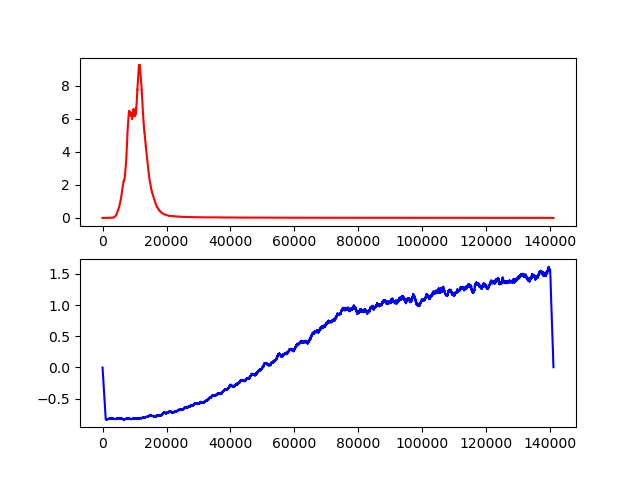
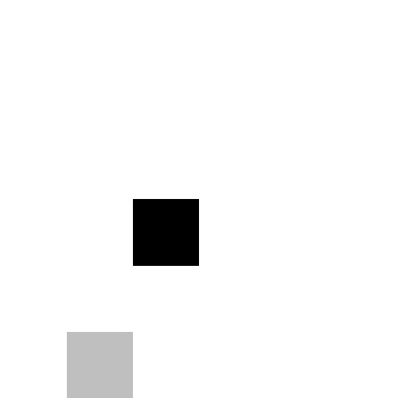
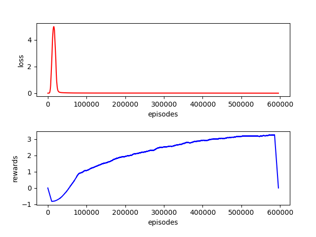

# DeepSnake
##### Training an AI to learn to play snake using Deep Q Learning and a Convolutional neural network.


## Description
I have been playing the snake in deep learning for quite a while trying to make it work.
I have failed to make the snake learn using a CNN feeding it the whole screen.
This repo was a new clean implementation which is where i learned from my mistakes and it seems to work (although 
very slow).

### Deep Q Learning 
The main idea behind Deep Q Learning is to replace the Q table in Q Learning with a complex function approximation 
which is where the Deep Neural network comes to play.
In the training process you let the network play a couple games (choosing the action using the epsilon-greedy policy)
, save the actions and states that were played during those games in whats called a "replay memory".
sample random states from the replay memory and train on them by letting the network predict the Q value for the next
 step and let it try to minimize the distance from the predicted value to the estimated truth (calculted using the 
 bellman equation).

### Fine tuning

#### Network architecture
The input for the network is the last two frames played by the snake each is a 6 by 6 grid (can be adjusted).
the 6x6x2 tensor is fed into a convolutional layer with 16 3x3 filters followed by a ReLU followed by another 
convolutional layer with 32 3x3 filters, followed by two fully connected layer with 64 and 4 neurons.
I used RMSProp since Adam didn't work for me very well on other implementations.

#### Parameters
epsilon is started as 1 (100% randomness) and is decayed with rate of .97 every 1000 episodes.
batch size is set to 64, it seems to be common for other people and higher batches seems to not get better results.
replay memory size is 200,000.
gamma is set to .99
Learning rate is set to 5e-4.

#### Rewards
rewards were set to +1 for eating a food, -1 for game over and 0 for everything else. 


## Results
Loss (red) and average reward (blue) with running average over 1000 iterations after 140K episodes, playing 8 games 
per episode.



Current best snake (`2021_03_19_16_57_139999` checkpoint)




###### After 570K episodes (about 33 hours on my crappy CPU, about 200M steps played, 4.5M games played):




## How to use
install requirements (pytorch, numpy and opencv)
```bash
pip install -r requirements.txt
```

##### Train
```bash
python main.py
```
This should start a training session.
checkpoints of the network will saved on `checkpoints` folder while training.

optional flag are the `--load` flag to retrain from a checkpoint,
and the `--config` flag to load config from a config file. 

The parameters could be adjusted in the `config.json`file:
```json
{
  "e": 1,
  "e_decay": 0.97,
  "e_min": 0.1,
  "e_decay_frequency": 1000,
  "batch_size": 64,
  "max_replays": 200000,
  "episodes": 1000000,
  "gamma": 0.99,
  "learning_rate": 0.0005,
  "games_per_episodes": 8
}
```
or create a another json file and use it with the `--config` flag.

While training the loss and average reward are saved to files, to display graphs of those metric you can use:
```bash
python display_results.py
```
This will read the values from the `loss` and `rewards` files in the `data` folder and display the graphs.


##### Evaluation
Checkpoints will be saved in the `checkpoints` folder.
To see how the snake is performing you can run:
```bash
python play_model.py checkpoints\1111-11-11_11_11_11_111111
```
on a specific checkpoint you want.
